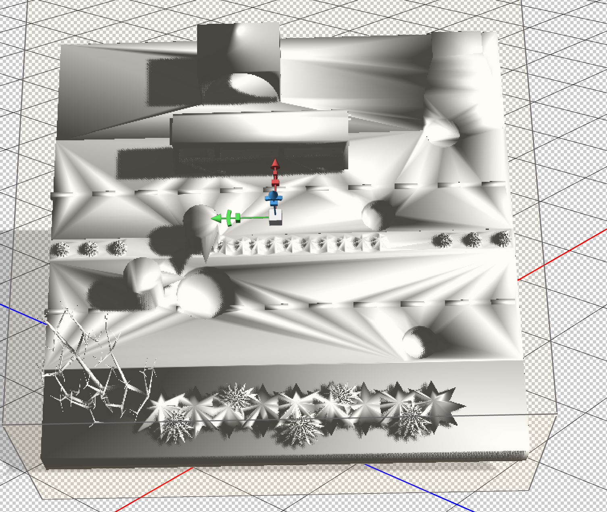

Date: May 9, 2019
Medium: 3d model designed in Tinker cad and 3D printed
Title: Printing on the Road
Description: Incorporating 3D printers into common areas such as construction sites and city streets. Maintaining these areas and providing efficient handling of city structures.

I decided to make a small model of my design and idea using 3d printers. The model represents a two way street with the common design elements around and in it such as plants, cars, turns and a bus stop. The road has some slight problems and if you examine it closely you are able to see a few potholes in the street. This can be related to our own city and its many car damaging holes.

I choose this method of documenting in order to not only use the machine I am researching, the 3d printer, but to expand on it's capabilities. I thought of making a replica or model of the 3d printer that might be used for such a task, but there are already printers out there that can use outsourced material as well as move around on their own. Using that technology can create a more portable and manageable machine to put onto the streets. Since city potholes are on the lower end of the managing and fixing scale for construction workers, they can just use the 3D printing machines. If there is one to three people managing a mile or so of the area, the 3D printers can go off on their own fixing the holes as they are commanded to with programming.

In a way, the idea can be compared to cement trucks or any other construction machine used to build or develop land. With the easy portability of the design as well as how efficient it is, the printer wastes no time at all. Some may say that it is still a problem since the new machines could replace actual workers, but as previously mentioned, there will still be workers surveillancing, programming and guiding the machines. Also, there are far too many potholes and tiny inconvenience that construction workers don't typically put too much of their time and effort in.

