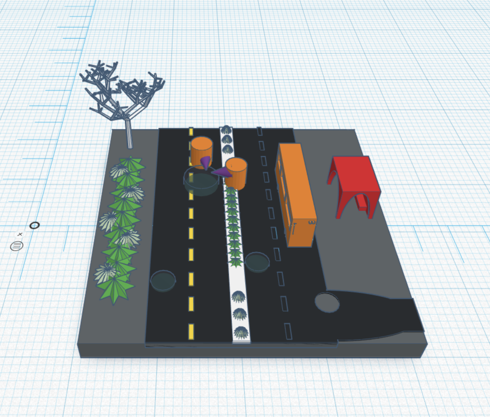

Date: May 9, 2019
Medium: Digital model made with Tinkercad software, eventually to be 3D printed
Description: I sketched out some ideas and developed in Tinkercad

After producing a simple piece of custom software for drawing with Emoji's I've begun creating portraits with it, here is my first one, Kim.

At first I drafted various ideas and questions regarding 3D printing and what future it can have. I then processed to drift the future of 3d printing into one that's more reliable and helpful in a construction aspect, as well as city development. Since cities have more holes that could be fixed I decided to focus and implement 3d printers to help fix this problem and to slowly be able to implement them into our working force.

I made a few different models and designs in order to see if I should use a city scape or a flat land. I ended up going with a flatter plane so the potholes are more visible. I also added in some living elements to make it seem like a simulation.

I was thinking of creating an animation of the design as well, but, decided on using sketches and models to better represent how architects and city workers interact and work together. The whole process of designing the landscape around the problem also drew me in.

 
