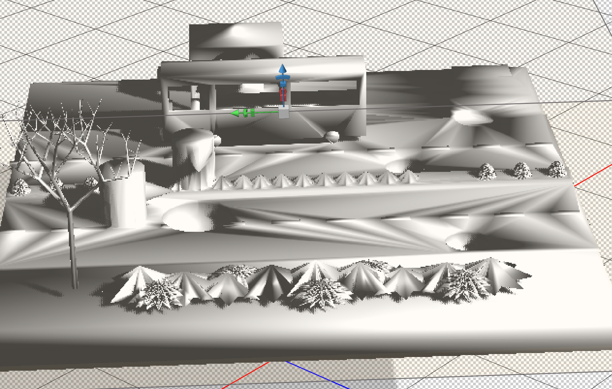

Date: March 3, 2019
Description: Looking up videos online as well as reading articles of varies types of 3D printing machines and milestones that have been achieved.

The whole idea of having buildings and structures 3d printed is not a new concept.
There are already companies that run tests to see how proficient and reliable 3d printing
can be. Some include Evan Loomis' project where he challenged that he could build a house
in less than 24 hours and under $4,000, the house was 650 square feet. Multiple companies in
Europe are experimenting and starting to rely on 3d printers to build house, some companies include
Apis Cor, based in Russia and Van Wijnen in the Netherlands. They already trialed and built
houses, used the printer to lay bricks, and help with laying concrete. The versatility of these
machines is only limited to ones imagination. In the Netherlands, they are actually implementing
3d printers to create unique houses and expect people to live in these houses by 2019. The only reason
they allow this is due to the shortage of brick layers in the country.

A few problems that came up with the practicality and whole concept of 3d printers is the fact that
they could potentially put many out of jobs. It seems that most of the experiments are done abroad,
mainly by European companies. Speaking with an architect I found that in the United States there
is a main corporations that sends out city workers and they prefer not to have their work
done by computers. This problem doesn't occur in Europe. Also, abroad they didn't build
a full house and only used the printers to lay brick or do some of the basic foundation. There is still
a chance to have this implemented into society as a normal way for structures to be built.
If complete houses and buildings are too far a step, then 3d printers could be implemented by fixing
broken structures, filling potholes, or small things around cities or towns.

Crane wasp: can use any material found around the site as well as any other material given to the printer,
a 10,000 dollar house. It acts as a crane and allows the printer to move freely in any pattern and direction
allowing for various designs and styles.

 
 
